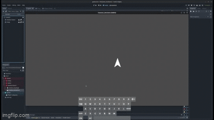
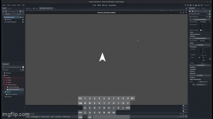
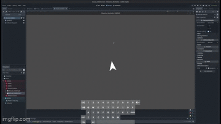
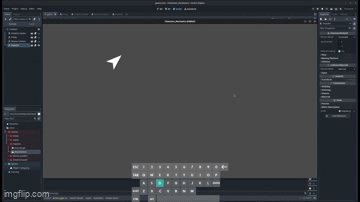
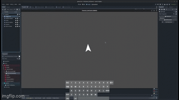

# Top-down Player Movement

```
Godot Version: 4.2.1
Tested on: February 6, 2024
Created by Sebastian Shirk
```
This recipe will cover how to create different top-down player movement systems. These systems will include `8-way movement`, `rotation-based`, `mouse-rotation`, `impulse`, and `click-to-move`. This recipe will also cover `screen wrap`.

> **Note:** This recipe will be tailored to an upwards facing sprite. If you are using a different sprite, you may have to adjust the code to fit your needs when using rotation-based and mouse-rotation movement. Notes will be provided to show you where to make these changes.

## Setting up the Character
* Each one of these movement systems will use the same setup for the player character.
* Create a new scene and make the root node a `CharacterBody2D` node. Rename and save the scene as `Player.tscn`. Add a `Sprite2D` and a `CollisionShape2D` or `CollisionPloygon2D` as children of the `Player` node. Add in the texture you want to use for your player and create the collision shape or polygon you want to use as your players collision. 
* We will go ahead and allocate the keys we want to use for the player movement. In the `Input Map` tab found in the project settings, add the following inputs:
* If using 8-way movement:
    * `move_up` - `W`
    * `move_down` - `S`
    * `move_left` - `A`
    * `move_right` - `D`
* If using rotation based movement:
    * `rotate_left` - `A`
    * `rotate_right` - `D`
    * `move_forward` - `W`
    * `move_backward` - `S`
* If using mouse rotation movement:
    * `move_forward` - `W`
    * `move_backward` - `S`
* If using impulse movement:
    Use any of the input methods previously mentioned. All will work for this movement type when properly implemented.
* If using click-to-move movement:
    * `click_to_move` - `Mouse Button Left`


## 8-way Movement

* We want to create a script that will handle movement in all 8 directions.
* Create a new script and attach it to the `Player` node.
* Lets add the one key variable we need for player movement. Move speed. Add the following variable to the top of the script:
```gdscript
var move_speed = 500
```
### Broken Down Example
* Now we want to create a function that will handle the player movement. Add the following code to the physics process function:
```gdscript
    var input_direction = Vector2()
    if Input.is_action_pressed("move_left"):
        input_direction.x -= 1
    if Input.is_action_pressed("move_right"):
        input_direction.x += 1
    if Input.is_action_pressed("move_up"):
        input_direction.y -= 1
    if Input.is_action_pressed("move_down"):
        input_direction.y += 1
    
    velocity = input_direction.normalized() * move_speed
    
    move_and_slide()
```
* Lets break down what is happening here. We are getting the input direction from the `Input` class. We are then normalizing the input direction. This will give us the velocity we need to move the player. We then use the `move_and_slide` function to move the player. This function will also handle any collisions for us.
### Efficient Way
* Now we want to combine all of the input checks into one line of code. This will make our code more efficient.
```gdscript
	var input_direction = Input.get_vector("move_left", "move_right", "move_up", "move_down")
	velocity = input_direction * move_speed
	
	move_and_slide()
```
* Lets break down what is happening here. We are getting the input direction from the `Input` class. We are then multiplying the input direction by the move speed. This will give us the velocity we need to move the player. We then use the `move_and_slide` function to move the player. This function will also handle any collisions for us.

* Lets test this code by running the scene. If you have a `Camera2D` you will have to toggle off its `Enable` property in the `Inspector` to see the affects of your script. If you are placing your `Player` in a seperate scene and want to keep the `Camera2D` on, make sure to add other nodes to the scene so that the player can be seen moving as the other nodes remain stationary. Otherwise, you will not see the player move.


## Rotation Based Movement

* We want to create a script that will handle movement based on rotation controlled by our keyboard.<br/>  
* Create a new script and attach it to the `Player` node.
* Make sure ou have the `move_speed` variable from the previous example in your script as well as a `rotation_speed` variable.
```gdscript
var move_speed = 500
var rotation_speed = 3
```
### Broken Down Example
* Now we want to create a function that will handle the player movement. This code is good at showing what we want, but is inefficient. We will show a more efficient way to handle this after this example.
```gdscript
    var input_direction = Vector2()
    if Input.is_action_pressed("rotate_left"):
        rotation -= 3
    if Input.is_action_pressed("rotate_right"):
        rotation += 3
    if Input.is_action_pressed("move_forward"):
        input_direction = Vector2(0, -1)
    if Input.is_action_pressed("move_backward"):
        input_direction = Vector2(0, 1)
    
    velocity = input_direction.rotated(rotation) * move_speed
    
    move_and_slide()
```
* This function clearly shows what is happening when we press all the different keys. We are getting the input direction from the `Input` class. We are then rotating the input direction by the players rotation. This will give us the velocity we need to move the player. We then use the `move_and_slide` function to move the player. This function will move us and handle any collisions for us.
### Efficient Way
* A much more efficient way to handle this would look like this:
```gdscript
	rotation += Input.get_axis("rotate_left", "rotate_right") * rotation_speed * delta
	velocity = -transform.y * Input.get_axis("move_down", "move_up") * move_speed
	
	move_and_slide()
```

> **Note:** The -transform.y is used for an upward facing sprite. Change this value if your sprite is facing a different direction.

* This code is much more efficient because we are using the `Input` class to get the axis of the keys we are pressing. We are then multiplying the axis by the rotation speed and delta to get the rotation we need. We are then multiplying the axis by the move speed and the players rotation to get the velocity we need to move the player. We then use the `move_and_slide` function to move the player. This function will move us and handle any collisions for us.


## Using Mouse Rotation

* We want to create a script that will handle movement based on rotation controlled by our mouse.
* Create a new script and attach it to the `Player` node.
* Make sure ou have the `move_speed` variable from the previous example.
```gdscript
var move_speed = 500
```
### Broken Down Example
* Now we want to create a function that will handle the player movement. This code is good at showing what we want, but is inefficient. We will show a more efficient way to handle this after this example.
```gdscript
	var input_direction = Vector2()
	var mouse_position = get_global_mouse_position()
	var angle = (mouse_position - global_position).angle()
	if Input.is_action_pressed("move_up"):
		input_direction = Vector2(0, -1)
	if Input.is_action_pressed("move_down"):
		input_direction = Vector2(0, 1)
	
	rotation = angle + (0.5 * PI)
	velocity = input_direction.rotated(rotation) * move_speed
	
	move_and_slide()
```
* In this function we can see that we are getting the mouse position using `get_global_mouse_position()`. We are then getting the angle between the mouse position and the players position. Then we are setting the players rotation to the angle we just got. We are then getting the input direction from the `Input` class and rotating the input direction by the players rotation. This will give us the velocity we need to move the player. We then use the `move_and_slide` function to move the player. This function will also handle any collisions for us.
### Efficient Way
* A much more efficient way to handle this would look like this:
```gdscript
	rotate(get_angle_to(get_global_mouse_position()) + (0.5 * PI))
	velocity = -transform.y * Input.get_axis("move_down", "move_up") * move_speed
	
	move_and_slide()
```

> **Note:** The + (0.5 * PI) is used for an upward facing sprite. Change this value if your sprite is facing a different direction.

* This code is much more efficient because we are simply telling our player to rotate to the angle of the mouse position, followed by getting our inputs and moving accordingly.

## Using Impulse Movement

* Impusle movement is movement that constantly adds to the players velocity. This is useful for games that want to build up to speed or for games that want less friction, like a space game.
* Create a new script and attach it to the `Player` node.
* Make sure ou have the `move_speed` variable from the previous example, but tuned down a little. Also add the `rotation_speed` variable if you want to use rotation based movement.
```gdscript
var move_speed = 50
var rotation_speed = 3
```
* For this example we will be adding impulse to our `move_up` and `move_down` inputs and keeping the `rotate_left` and `rotate_right` inputs to rotate our player. Impulse can still be added to 8-way movement and mouse rotation movement as well.
* We will only be showing the efficient way to handle this movemnt since it is so much like the rotation based movement.
```gdscript
	rotation += Input.get_axis("rotate_left", "rotate_right") * rotation_speed * delta
	velocity += -transform.y * Input.get_axis("move_down", "move_up") * move_speed
	
	move_and_slide()
```
* As we can see, we are using the same code as the rotation based movement, but we are adding to the players velocity instead of setting it. This will give us the "impulse" affect we need to move the player.
* This will give us a lot of sliding with our player. If you want to add friction to your player, you can add the following code to the end of the physics process function:
```gdscript
	velocity = lerp(velocity, Vector2.ZERO, 1 * delta)
	if velocity.length() >= -10 && velocity.length() <= 10:
		velocity = Vector2.ZERO
```
* Now we have an artificial friction that will slow our player down over time. 

## Click-to-Move Movement

* We want to create a script that will handle movement based on clicking the mouse.
* Create a new script and attach it to the `Player` node.
* Make sure ou have the `move_speed` variable from the previous example as well as a new target variable.
```gdscript
var move_speed = 500
@onready var target = position
```
* Here is the code for the `process` function:
```gdscript
	if Input.is_mouse_button_pressed(MOUSE_BUTTON_LEFT):
		target = get_global_mouse_position()
		
	velocity = position.direction_to(target) * speed
	look_at(target)
	if position.distance_to(target) > 10:
		move_and_slide()

```
* In this function we can see that we are getting the mouse position using `get_global_mouse_position()`. We are then setting the players target to the mouse position. We are then getting the direction to the target and setting the players velocity to the direction times the speed. We are then using the `look_at` function to make the player look at the target. We are then checking if the player is close to the target and if it isn't, we are moving the player using the `move_and_slide` function. When the player gets close enough to the target, the player will stop moving.

> **Note:** The `look_at` function is used for a left-facing sprite and will not work properly for a sprite facing a different direction. You will have to use a different method to make the player look at the target.

## Screen Wrap

* Screen wrap is a feature that will allow the player to wrap around the screen when they reach the edge. 
* In your player script, add a new variable:
``` gdscript
@onready var screen_size = get_viewport_rect().size
```
* In your player script, add the following code to the `process` function:
```gdscript
    if position.x > screen_size.x:
        position.x = 0
    if position.x < 0:
        position.x = screen_size.x
    if position.y > screen_size.y:
        position.y = 0
    if position.y < 0:
        position.y = screen_size.y
```
* This code will check if the player is at the edge of the screen and if it is, it will move the player to the opposite side of the screen. This will give us the screen wrap affect we want.