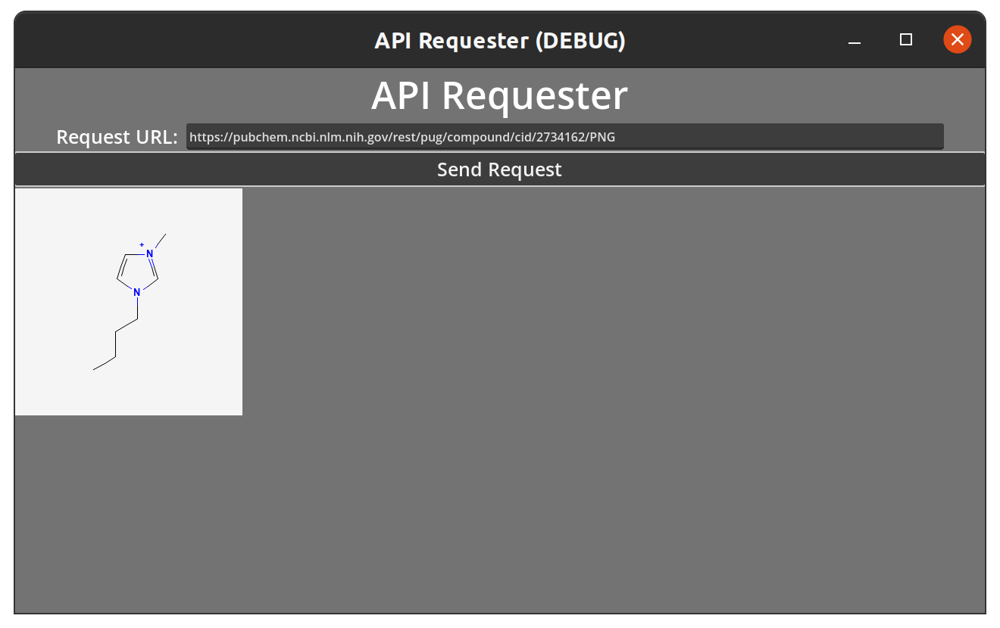
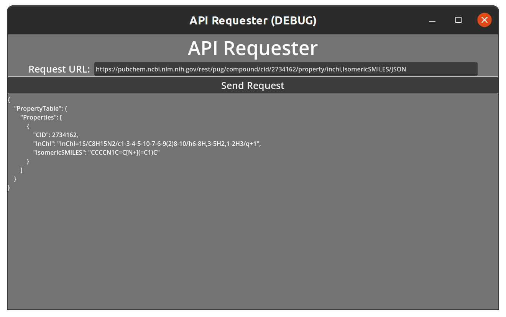
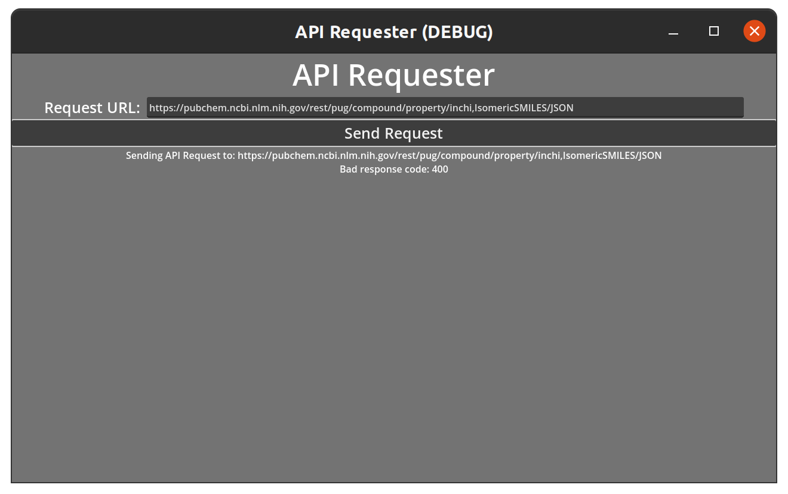

# HTTP Requests

```
Godot Version: 4.2.1
Tested on: February 5, 2024
Created by Avery Fernandez
```

Godot has a built-in `HTTPRequest` node that can be used to make HTTP requests. This can be useful for things like downloading files, sending data to a server, or fetching data from a server. In this recipe, we will use the `HTTPRequest` node to fetch data from a server.

For this recipe, we will use the [PubChem REST API](https://pubchemdocs.ncbi.nlm.nih.gov/pug-rest) along with creating a simple GUI to display the data. 

## Create the GUI

First, we will create a simple GUI to display the data. Let's create a new scene by pressing the `+` button on the top and then click `User Interface`. Go ahead an name this scene `User Interface` and save it.

### Adding a background

We want to have a background for our GUI. We can do this by adding a `ColorRect` node. Right click on the `control` node and click `Add Child Node`. Search for `ColorRect` and click on it. We can change the color of the `ColorRect` by clicking on the `Color` property in the `Inspector` tab. I like to use a light gray color. In order to have the `ColorRect` fill the entire screen, we need to click on the `ColorRect` node and then click on the `Anchor Presets` button. Click the `Fill` button to make the `ColorRect` fill the entire screen.

### Creating our container

We will use a `VBoxContainer` to hold our GUI elements. Right click on the `control` node and click `Add Child Node`. Search for `VBoxContainer` and click on it. We will use this container to hold our GUI elements. I recommend having the container anchored to the `Top Wide` of the screen.

#### Adding a label

We will use a `Label` to display the app name. Right click on the `VBoxContainer` node and click `Add Child Node`. Search for `Label` and click on it. You can change the text of the `Label` by clicking on the `Text` property in the `Inspector` tab. I will use the text `API Requester`. So that the text is centered, click on the `Horizontal Align` property in the `Inspector` tab and select `Center`. I also like to increase the font size to `50` by clicking on the `Font Sizes` property in the `Inspector` tab under `Theme Overrides`.

#### Input Container

We will use a `HBoxContainer` to hold our input elements. Right click on the `VBoxContainer` node and click `Add Child Node`. Search for `HBoxContainer` and click on it. We will use this container to hold our input elements. So that the container is centered, click on the `Alignment` property in the `Inspector` tab and select `Center`.

##### Adding a label

We will use a `Label` to display the input label. Right click on the `HBoxContainer` node and click `Add Child Node`. Search for `Label` and click on it. You can change the text of the `Label` by clicking on the `Text` property in the `Inspector` tab. I will use the text `Request URL: `. For now, set the font size to `25` by clicking on the `Font Sizes` property in the `Inspector` tab under `Theme Overrides`.

##### Adding a text edit

We will use a `TextEdit` to allow the user to input the URL. Right click on the `HBoxContainer` node and click `Add Child Node`. Search for `TextEdit` and click on it. You can name this node `API URL`. So that the `TextEdit` is a bit larger, set the `Custom Minimum Size` property in the `Inspector` tab to `1000` in the `x` property. Some URLs can be quite long and it won't fit on the screen, so we want to make sure the text gets correctly cut off. To do this, click on the `Wrap Mode` property in the `Inspector` tab and select `Boundary`. I also change the `Placeholder Text` to `Enter the API URL here`.

#### Adding a button

We will use a `Button` to allow the user to submit the request. Right click on the `VBoxContainer` node and click `Add Child Node`. Search for `Button` and click on it. You can name this node `Send Request Button`. You can change the text of the `Button` by clicking on the `Text` property in the `Inspector` tab. I will use the text `Send Request`. So that the button text is a bit larger, set the font size to `25` by clicking on the `Font Sizes` property in the `Inspector` tab under `Theme Overrides`.

#### Adding an Output

We will use a `RichTextLabel` to display the data from the request. Right click on the `VBoxContainer` node and click `Add Child Node`. Search for `RichTextLabel` and click on it. You can name this node `Output`. I went ahead and adjusted the `Custom Minimum Size` property in the `Inspector` tab to `500` in the `y` property.

`RichTextLabel`s are a bit different than `Label`s. They can display rich text, which means we can display things like bold text, italic text, and even links. We will use this to display the data from the request. In order to do such, we will need to use `BBCode`. So that the `RichTextLabel` can display the data correctly, we need to set the `Bbcode Enabled` property in the `Inspector` tab to `true`. This will later allow us to center some text.

### Adding the Request Node

We will use a `HTTPRequest` node to make the request. Right click on the `User Interface` node and click `Add Child Node`. Search for `HTTPRequest` and click on it. We will use this node to make the request.

### GUI Hierarchy

Once you have added all the nodes, your scene should look something like this:

```
User Interface
|- ColorRect
|- VBoxContainer
   |- Label
   |- HBoxContainer
      |- Label
      |- API URL
   |- Send Request Button
   |- Output
|- HTTPRequest
```

The order of the nodes are important. As for the `Color Rect` it will block anything above it in the hierarchy. While the `BoxContainer` will organize the nodes based on the order they are in.

## Request Code

Now that we have our GUI set up, we can start writing the code to make the request. Let's create a new script by clicking on the `User Interface` node and then clicking on the `Attach Script` button. You can name this script `user_interface.gd`.

### Accessing the Nodes

First, we need to grab access to some of the nodes in the scene. We can do this by dragging the nodes from the `Scene` tab to the `Script` tab and before releasing the mouse button, we press `Control`. This will create an `onready var` for us. We will need to do this for the `HTTPRequest` node, `Send Request Button`, `API URL`, and `Output`. 

```gd
@onready var api_url = $"VBoxContainer/HBoxContainer/API URL"
@onready var send_request_button = $"VBoxContainer/Send Request Button"
@onready var output = $VBoxContainer/Output
@onready var http_request = $HTTPRequest
```

### Connecting the Button

We will also need to connect the `Send Request Button` to a function. We can do this by clicking on the `Send Request Button` node and then clicking on the `Node` tab in the `Inspector` tab. Click the `Connect` button and then click the `pressed()` signal. It should create a function called `_on_send_request_button_pressed`. 

```gd
func _on_send_request_button_pressed():
    pass
```

### Making the Request

When we click the `Send Request Button`, we want to grab the text from the `API URL` `TextEdit` and then send a request out to the server. So inside the `_on_send_request_button_pressed` function, we will grab the text from the `API URL` and clean it up, then disabled the `Send Request Button` so that the user can't spam the server with requests, after that we will send the request with some error handling.

```gd
func _on_send_request_button_pressed():
    output.clear()
    var request_url = api_url.text.strip_edges()
    send_request_button.disabled = true
    var error = http_request.request(request_url)
    output.append_text("[center]Sending API Request to: " + request_url + "\n")
    if error != OK:
        output.add_text("An error occurred while sending the request: " + str(error) + "\n")
        send_request_button.disabled = false
```

The `strip_edges()` function will remove any leading or trailing white spaces from the string. 

The `append_text()` function will add the text to the `RichTextLabel` and the `[center]` is a `BBCode` tag that will center the text.

The `error` variable will hold the error code if there is an error. If there is an error, we will add the error to the `RichTextLabel` and then enable the `Send Request Button` again.

### Handling the Response

We will also need to connect the `HTTPRequest` node to a function. We can do this by clicking on the `HTTPRequest` node and then clicking on the `Node` tab in the `Inspector` tab. Click the `Connect` button and then click the `request_completed()` signal. It should create a function called `_on_http_request_request_completed`. 

```gd
func _on_http_request_request_completed(result, response_code, headers, body):
    pass
```

Inside the `_on_http_request_request_completed` function, we will check if the request was successful, and if it was, we will display the data in the `RichTextLabel`. 

```gd
func _on_http_request_request_completed(result, response_code, headers, body):
    send_request_button.disabled = false
    if result != HTTPRequest.RESULT_SUCCESS:
        output.append_text("[center]")
        output.add_text("Request has failed with error code: " + str(result) + "\n")
        return
    if response_code != 200:
        output.append_text("[center]")
        output.add_text("Bad response code: " + str(response_code) + "\n")
        return
    output.clear()
```

The `RESULT_SUCCESS` is a constant that is used to check if the request was successful. The `200` response code is a standard response for a successful HTTP request.

While the `response_code` is a standard response code for a successful HTTP request, it is not always the case. Some servers may return a `200` response code even if the request was not successful. It is always good to check the body of the response to see if the request was successful.

### Displaying the Data

If the request was successful, we will display the data in the `RichTextLabel`. We also add functionality to support either `JSON` or `Image` data. So underneath the previous code, we will add the following:

```gd
    # Attempt to load if data is image
    var image = Image.new()
    var image_error = image.load_png_from_buffer(body)
    if image_error == OK:
        var texture = ImageTexture.create_from_image(image)
        output.add_image(texture)
        return
    # Attempt to load if data is JSON
    var json_parser = JSON.new()
    var json_error = json_parser.parse(body.get_string_from_utf8())
    if json_error == OK:
        var response = json_parser.get_data()
        output.add_text(JSON.stringify(response, '\t'))
        return
```

The `Image` class is used to load images from a buffer. We will use this to check if the data is an image. If it is, we will display the image in the `RichTextLabel`.

The `JSON` class is used to parse JSON data. We will use this to check if the data is JSON. If it is, we will display the JSON data in the `RichTextLabel`.

## Conclusion

We have created a simple GUI to display the data from an API request. We have also added functionality to support either `JSON` or `Image` data. This is a simple example of how to use the `HTTPRequest` node to make HTTP requests in Godot. You can use this as a starting point to create more complex applications that make use of the `HTTPRequest` node.

You can check to make sure everything is working by running the scene and using the following urls:

`https://pubchem.ncbi.nlm.nih.gov/rest/pug/compound/cid/2734162/PNG`



`https://pubchem.ncbi.nlm.nih.gov/rest/pug/compound/cid/2734162/property/inchi,IsomericSMILES/JSON`



`https://pubchem.ncbi.nlm.nih.gov/rest/pug/compound/property/inchi,IsomericSMILES/JSON`

