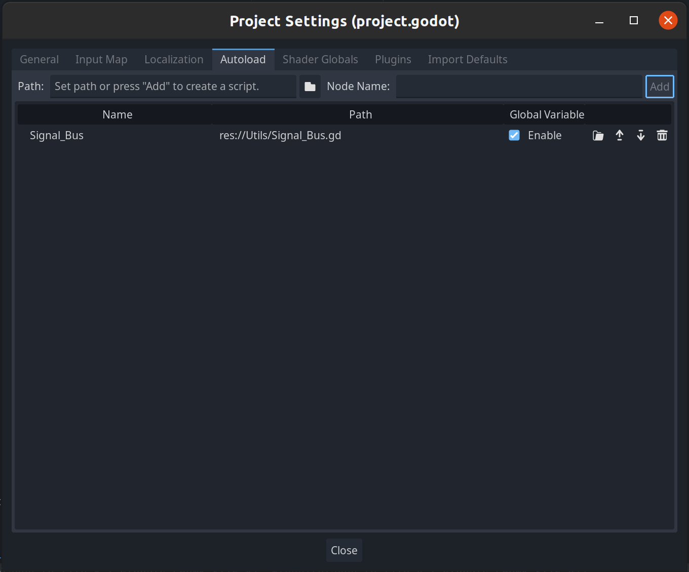

# Signal Busses 

```
Godot Version: 4.2.1
Tested on: Janurary 29, 2024
Created by Avery Fernandez
```

Godot uses a strong system of signals to communicate between nodes. This system is already super strong, but becomes limited when trying to communicate between nodes that are not directly connected. For example, if we have a `Player` node and a `World` node, and we want the `Player` node to communicate with the `World` node, we would have to connect the `Player` node to the `World` node. This can become a problem if the `Player` node is not a direct child of the `World` node. We can solve this problem by using signal busses.


## Create the Signal Bus

Signal busses can be established by creating an autoload script. Autoload scripts are scripts that are always running, and can be accessed from any other script. We will use this to create a signal bus.

First, we need to create the autoload script. I like to keep all my autoload scripts in a folder called `Utils` in the `res://` directory. Create a new script in the `res://Utils/` directory by right clicking on the `res://Utils/` directory, clicking `New Script`. You can name the script whatever you want, but I like to name it `Signal_Bus.gd`.

### Autoload the Script

We now need to autoload the script. To do this, click on the `Project` menu at the top of the screen and click `Project Settings`. In the `Project Settings` window, click on the `AutoLoad` tab. Click the `Folder` button, and navigate to your script (`res://Utils/Signal_Bus.gd`). Click `Open`. Now, you should see your script path in the `Path` column. Godot will automatically give it a `Node Name` based on the name of the script, but you can change it if you want. I like to keep it the same as the script name. Now you can click `Add` button to add the script to the autoload list. Finally, make sure the `Enable` checkbox is checked for your script.

