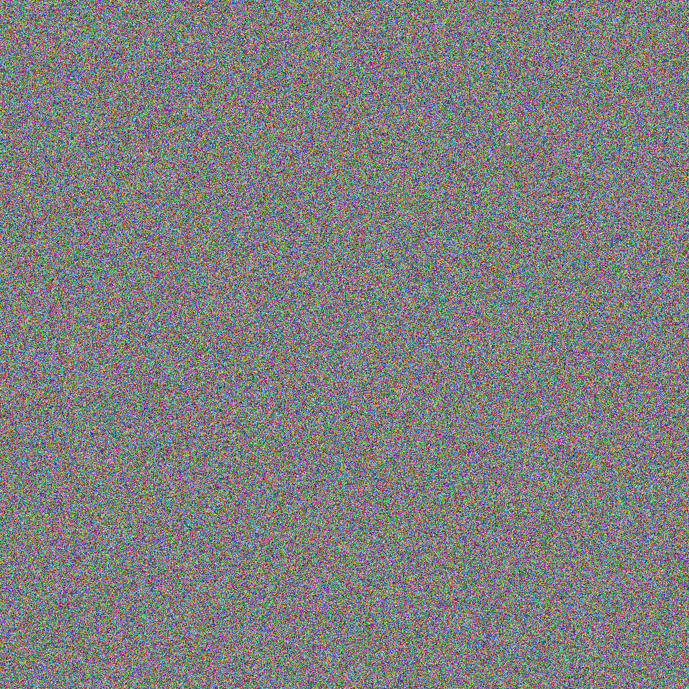
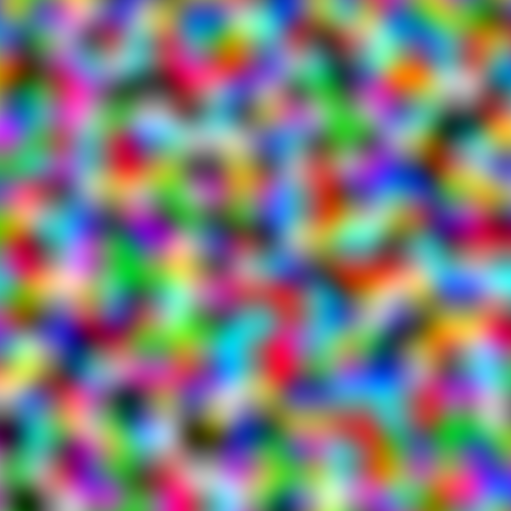

# 2D Perlin Noise Generation

```
Godot Version: 4.2.1
Tested on: Janurary 25, 2024
Created by Avery Fernandez
```

For our world generation, we want to simulate the real world. We will accomplish this by using Perlin noise to generate both the world altitude, but also the world temperature and humidity. We will use the 3 parameters in combination to determine what type of tile to use.

## What is Perlin Noise?

In order to generate a world, we have to use some function that creates random values. However, if we were to just use a random number generator we would get a world that looks like this:



What perlin noise does is it creates a smooth random value. This means that the values are not completely random, but instead are similar to the values around them. This creates a more natural looking world. Here is an example of what a world generated with perlin noise looks like:



As you can see, the world generated with perlin noise looks more natural. It has smooth transitions between the different types of tiles. This is what we want for our world.

## Setting up Perlin Noise

First, let's create the variables we will use to generate the world. Add the following variables to the script:

```gdscript
var moisture = FastNoiseLite.new()
var temperature = FastNoiseLite.new()
var altitude = FastNoiseLite.new()
```

Next, let's set the seed for each of the noise generators. We will use the seed to generate the same world each time. Add the following code to the `_ready` function:

```gdscript
func _ready():
	moisture.seed = randi()
	temperature.seed = randi()
	altitude.seed = randi()
```

For the seeds, we are using a random number generator to generate a random number. This will ensure that each time we run the game, we will get a different world. If you are programming this for a game where you can save the world, you will want to store that seed and use it every time you load the world. Basically, everytime you create a new world, generate a random number and use that as the seed. Then, store that seed and use it when you load the world.

## Generating the tile values

With the seed set, we want a function that takes the tile coordinates and returns the altitude, temperature, and moisture. Add the following function to the script:

```gdscript
func get_world_data(tile_location: Vector2):
	var altitude_value = altitude.get_noise_2d(tile_location.x, tile_location.y)
	var temperature_value = temperature.get_noise_2d(tile_location.x, tile_location.y)
	var moisture_value = moisture.get_noise_2d(tile_location.x, tile_location.y)
	return [altitude_value, temperature_value, moisture_value]
```
