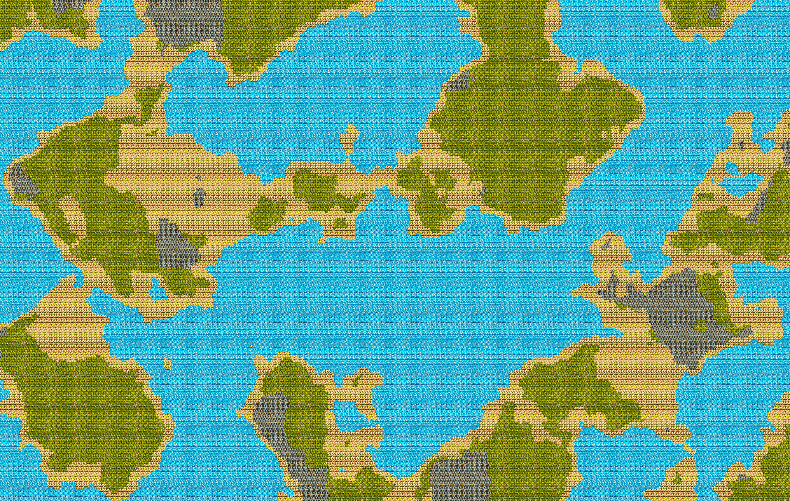

# World Generation using Perlin Noise

```
Godot Version: 4.2.1
Tested on: Janurary 25, 2024
Created by Avery Fernandez
```

For our world generation, we want to simulate the real world. We will accomplish this by using Perlin noise to generate both the world altitude, but also the world temperature and humidity. We will use the 3 parameters in combination to determine what type of tile to use.

## Select tiles using Perlin Noise

We want to use the altitude, temperature, and moisture to determine what type of tile to use. We will use the following table to determine what type of tile to use:

|     Altitude     |     Temperature     |     Moisture     |      Tile      |
| ---------------- | ------------------- | ---------------- | -------------- |
|     < 0          |     Any             |     Any          |     Water      | 
|     < .1         |     Any             |     Any          |     Sand       | 
|     > .1         |     < 0.25          |     < -0.25      |     Rock       | (Dry) (Cold)
|     > .1         |     < 0.25          |  -0.25 < < .25   |     Rock       | (Normal) (Cold)
|     > .1         |     < 0.25          |     > 0.25       |     Rock       | (Humid) (Cold)
|     > .1         |  -0.25 < < 0.25     |     < -0.25      |     Sand       | (Dry) (Normal)
|     > .1         |  -0.25 < < 0.25     |  -0.25 < < .25   |     Grass      | (Normal) (Normal)
|     > .1         |  -0.25 < < 0.25     |     > 0.25       |     Grass      | (Humid) (Normal)
|     > .1         |     > 0.25          |     < -0.25      |     Sand       | (Dry) (Hot)
|     > .1         |     > 0.25          |  -0.25 < < .25   |     Grass      | (Normal) (Hot)
|     > .1         |     > 0.25          |     > 0.25       |     Grass      | (Humid) (Hot)

You can use this table to determine what type of tile to use. For example, if the altitude is less than 0, then you will want to use a water tile. If the altitude is greater than 0.1, the temperature is less than 0.25, and the moisture is less than -0.25, then you will want to use a rock tile.

This table can be adjusted anyway you see fit. You can add more tiles, or change the values. For example, you may want to change the temperature values to be -0.5 to 0.5 instead of -0.25 to 0.25. You may also want to add more tiles, such as a snow tile for when it is cold and humid.

Now, let's create the function that will generate the world. Add the following function to the script:

```gdscript
func select_tile(tile_location: Vector2):
	var world_data = get_world_data(tile_location)
	var altitude_value = world_data[0]
	var temperature_value = world_data[1]
	var moisture_value = world_data[2]
	var tile_id = 0
    if altitude_value < 0:
        tile_id = 0
    elif altitude_value < .1:
        tile_id = 1
    else:
        if temperature_value < -0.25:
            if moisture_value < -0.25:
                tile_id = 3
            elif moisture_value < 0.25:
                tile_id = 3
            else:
                tile_id = 3
        elif temperature_value < 0.25:
            if moisture_value < -0.25:
                tile_id = 1
            elif moisture_value < 0.25:
                tile_id = 2
            else:
                tile_id = 2
        else:
            if moisture_value < -0.25:
                tile_id = 1
            elif moisture_value < 0.25:
                tile_id = 2
            else:
                tile_id = 2
    set_cell(0, Vector2i(tile_location), tile_id, Vector2i(0, 0))
```

This function takes the tile location and uses the `get_world_data` function to get the altitude, temperature, and moisture. It then uses the altitude to determine what type of tile to use. It then sets the tile at the tile location to the tile id.

## Generate the World

Now, let's generate the world. Add the following code to the `_ready` function:

```gdscript
func _ready():
    # ... Previous code ...
    for x in range(-100, 100):
		for y in range(-100, 100):
			select_tile(Vector2(x, y))
```

## Final Product

Now, you should have a world that looks like this:



This is with a scale of .1 and range of -1000 to 1000.
